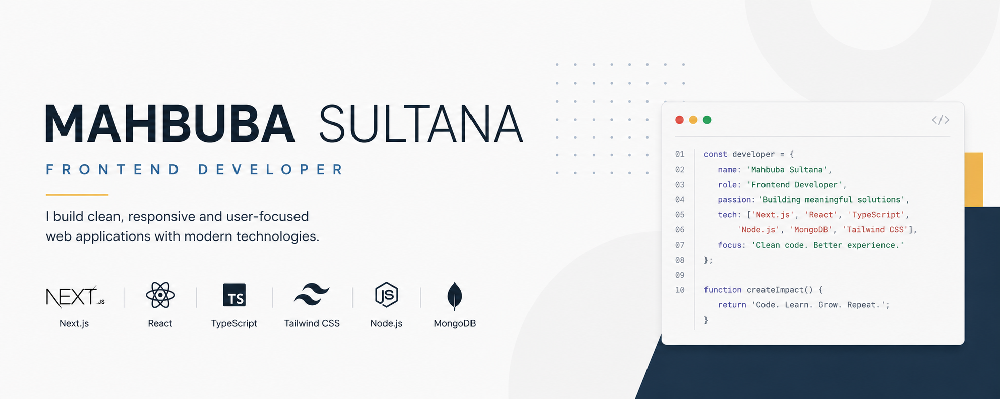

  

<h3 align="center">
Frontend Developer | Building responsive, accessible, and user-friendly web applications with React & Next.js
</h3>

  
  
  
  <!--  -->

---

## 👩‍💻 About Me

I'm a Frontend Developer passionate about building modern, responsive, and user-friendly web applications. I enjoy transforming ideas into clean and intuitive user interfaces while continuously improving my skills through real-world projects. Currently, I'm expanding my knowledge of the Next.js ecosystem, authentication, and backend integration.

---

## 🚀 Current Activities

* 🌱 Exploring **AI Integration in Web Projects**, **GSAP**, and modern frontend interactions
* 💻 Building real-world projects to improve my **full-stack development workflow** and practical problem-solving skills
* 🤝 Looking to collaborate on **Open Source** and **Full-Stack Web Development** projects
* 💬 Ask me about **HTML, CSS, JavaScript, React, Next.js, Tailwind CSS, Better Auth, Authorization & Rest API Integration**

---

## 🛠 Tech Stack

### Frontend

### Backend

### Tools

---

## 📫 Connect with Me

- 📧 **Email:** sultanamahbuba09@gmail.com
- 💼 **LinkedIn:** https://www.linkedin.com/in/mahbuba-sultana09
- 💻 **GitHub:** https://github.com/mahbubasultanaety
- 🧩 **LeetCode:** https://leetcode.com/mahbuba_sultana

---

## 📊 GitHub Stats

<!-- 

  
  

 -->

  

